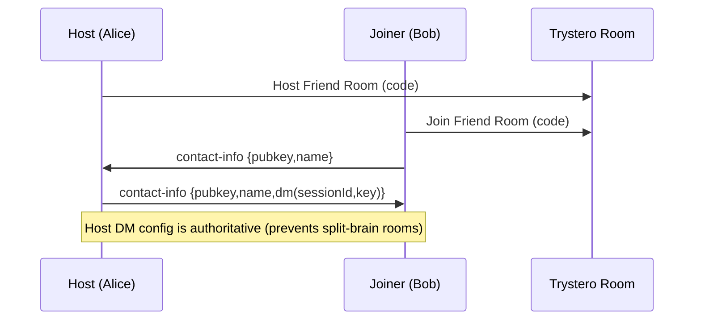
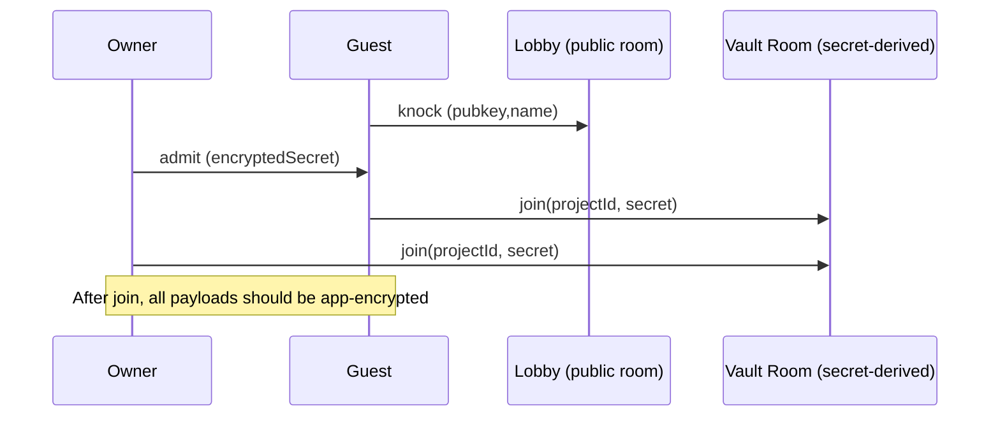

# holi-user — About

This app is the “User / Vault” client in the Holi tools monorepo.

It is built as an **offline-first** app (Astro + browser storage) with **P2P collaboration** over WebRTC. Trystero is used as the transport/signaling layer; **all application data should be treated as sensitive and must be protected at the app-protocol layer** (encryption + authorization), not only by transport.

## Goals

- Peer-to-peer collaboration (friends + projects) without central servers storing user data.
- “Always encrypted”: messages/files are never sent in plaintext at the application layer.
- Clear permission model: allowlist/blocklist; real revocation via key rotation (rekey).
- Avoid secret leakage: no logs with secrets, room IDs, or raw signaling payloads.

## High-level architecture

- **Identity**
  - A primary identity is auto-provisioned when opening/restoring a vault.
  - Identity is the anchor for trust decisions (allow/block) and for authenticated handshakes.

- **Transport / Signaling**
  - Trystero (nostr strategy) is used to establish WebRTC connections.
  - Nostr relays are used for signaling/discovery only; they are not trusted for privacy.

- **Application protocol (security boundary)**
  - All chat/file payloads should be encrypted at the app layer (AEAD envelopes + framing).
  - Room IDs / topics are treated as capabilities and must be high-entropy.

- **Storage**
  - Project/friend metadata and histories are stored locally under the user’s vault.
  - The app should never “scan disk”; it only reads/writes inside explicitly granted handles.

## Flows

### 1) Friend handshake (Friend Code → DM config)

Friend Code is a short-lived capability that allows two peers to exchange contact info and converge on **one shared DM config** (host authority).



Security notes:
- Friend Code must be **high entropy** (not short IDs). If leaked, anyone can attempt to join.
- The joiner should not generate its own DM secret; both must store the same config.

Related code:
- `src/lib/friends/friend-handshake.ts`

### 2) DM transport (Trystero DM room)

DM room identity is derived from the shared secret so that discovery does not reveal the raw secret.

```mermaid
flowchart LR
  S[Shared Secret (dm.keyB64Url)] --> H[SHA-256]
  H --> R[Room/Topic ID]
  R --> TR[Trystero joinRoom]
  TR --> DC[WebRTC DataChannel]
```

Security notes:
- Do not log: dm keys, derived room IDs, raw messages, raw signaling.

Related code:
- `src/lib/friends/trystero-dm.ts`

### 3) Project “Vault” collaboration

A project has a `projectId` and a secret (project master key). Peers join a vault room derived from `(projectId + secret)`.



Related code:
- `src/lib/p2p/trystero-lobby.ts`
- `src/lib/p2p/trystero-vault.ts`
- `src/lib/vault/controller.ts`

## Permissions & revocation (design rule)

- **Allowlist**: only explicitly accepted identities can join/participate.
- **Block**: blocks future sessions; does not retroactively delete data.
- **Real revocation requires rekey**:
  - Generate a new project secret.
  - Re-encrypt and distribute it only to allowed members.
  - Stop accepting traffic under the old secret.

## Anti-leak policy (must-follow)

- Never log secrets: friend codes, dm keys, project secrets, derived room IDs, raw Nostr events.
- If debug is needed, log only **redacted summaries** (prefixes/lengths) gated behind a debug flag.

Recent hardening:
- Removed raw Nostr event logging to avoid leaking encrypted payloads.
- Removed logging of host DM config during friend handshake.
- Increased Friend Code entropy to reduce brute-force risk.

## Environment

See `ENV.md` for runtime settings (e.g., relay overrides).

## Debugging

- Enable: `PUBLIC_HOLI_DEBUG=1`
- Expectation: debug logs must remain redacted (no secrets, no raw events).
